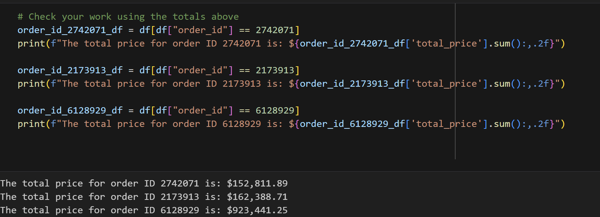
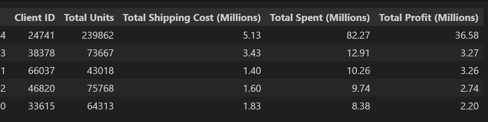

# The assignment.
Using the client_dataset.csv file, use Pandas to explore and transform the data, confirm my results, and then summarize and analyze the data.
## Exploring the data.
Using the df DataForm object, I viewed the column names by using the .columns.tolist() function.  Then used .describe(), .shape, .dtypes, .count(), and .isnull() to understand the data I was working with.  There were 54,639 rows x 18 columns, with no null values.

Then I answered the challenge questions using the data:
- Consumables (23,538), furniture (11,915), and software (8,400) were the categories with the most entries.  I did this using the .value_counts() function on the category heading.
- Under the consumables category, bathroom supplies (6,424) were the largest subcategory.
- Clients 33615, 66037, 46820, 38378, and 24741 had the most entries in the data set.  I used .value_counts() on the client_id category to get that data.  Then stored the client_ids to top_5_clients_df.
- Client 33615 had 64,313 order entries.

# Transforming the data.
The first few steps were to:
- add a column for subtotal by multiplying qty * unit_price,
- add a column for total_weight by multipling qty * unit_weight.  This value will be used to calculate line item shipping costs.
- add a column for shipping_price using a lambda function to multiply total weight by 7 if total_weight is greater than 50 lbs.  Else mutliply total_weight by 10.

- add a colum for total_price and tax.  Tax = (subtotal + shipping_price) * the tax rate of .0925.  Then add the subtotal, shipping_price, and tax amount to get the total_price.
- add a column for cost by multiplying qty * unit_cost
- add a column for profit, wich is total_price - cost.

# Confirming results.
The output for the three orders listed totaled correctly.

# Summarize and analyze results.

The final, sorted (by profit) output for the top 5 clients was as follows.

Some key observations about the data:

Client 24741 had the highest spend--6X higher than the second most profitable client.

The orders for client 24741 were also more profitable than the other clients (of the top 5).

Clients 38378. 48620, and 33615 purchased more units but at a lower cost and margin than client 66037.

---
Assignment completed by Louis Canjar and saved in GitHub under pandas-challenge-1.